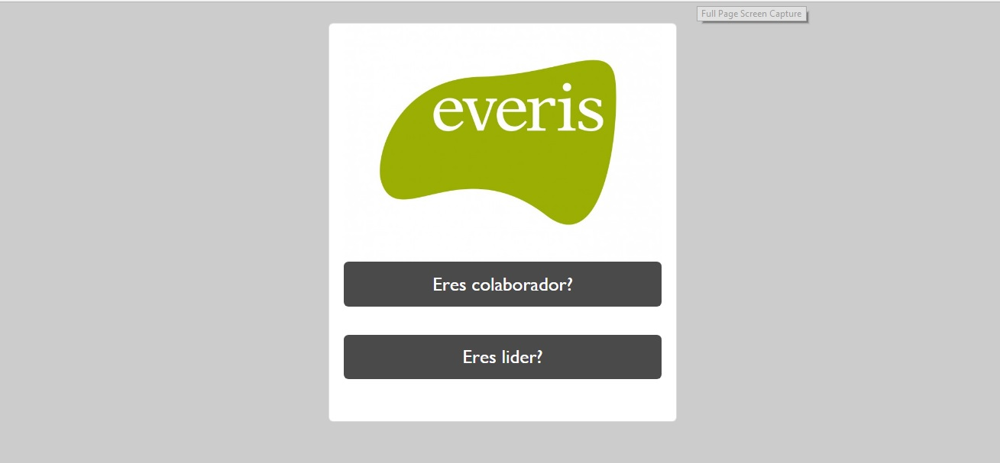
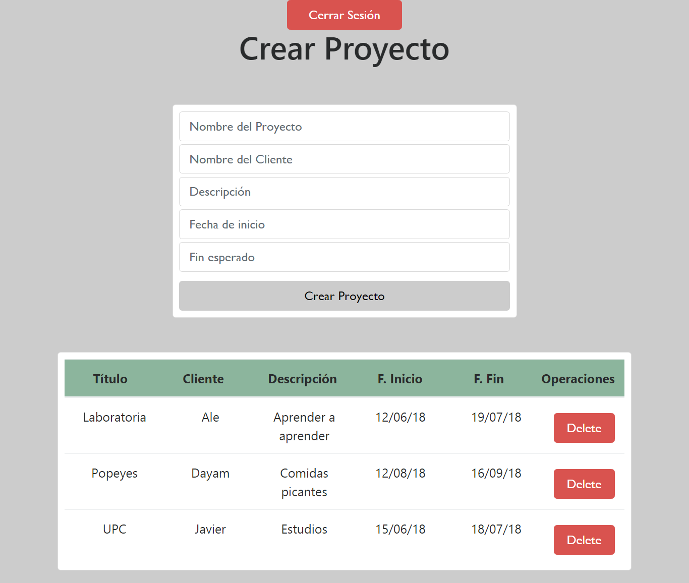
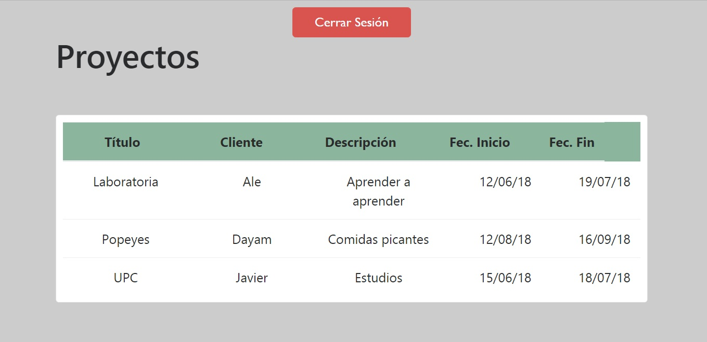
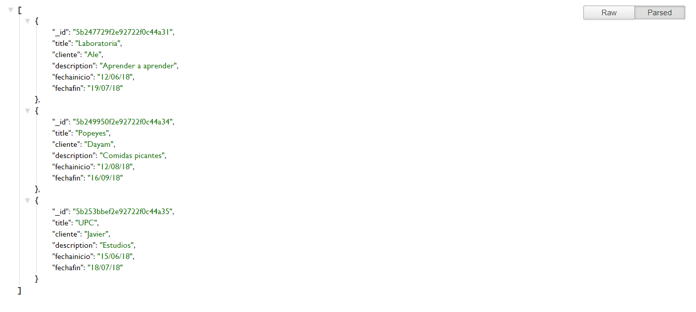

# PROYECTO DE EVERIS

La plataforma esta creada para colaboradores y para un líder de proyecto.

## Funciones del Líder: 

- El líder podra crear proyectos y guardarlos en la API creada con mongoDB, también podra eliminar cualquier proyecto.

## Funciones del Colaborador:

- El colaborador podra ver todos los proyectos que el líder guardó en la API, más no podrá editar ni borrar ningun proyecto.

## Validaciones:

- Se logró validar el login del colaborador como del líder.
- El líder puede ingresar a la vista del colaborador.
- El colaborador no puede ingresar a la vista del líder, nisiquiera cambiando la url, ya que es SPA.

## Tecnologias utilizadas: 

- AngularJS
- APIRest
- NodeJS
- MongoDB
- Express
- SPA
- Routes

## Autora: Laura Jimenez
